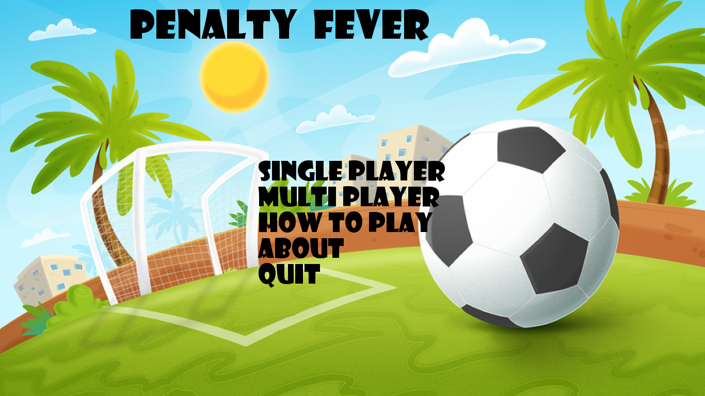
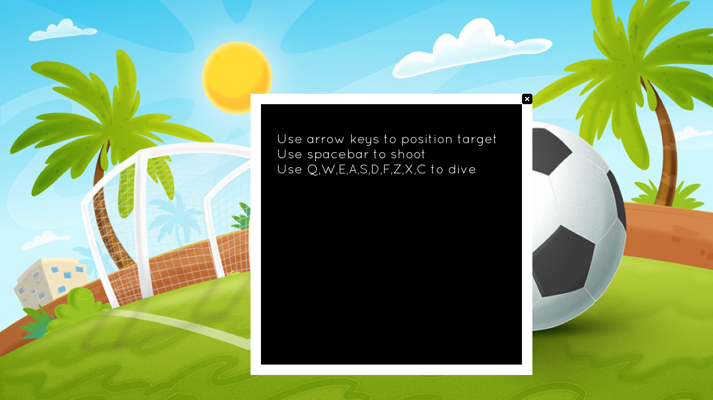
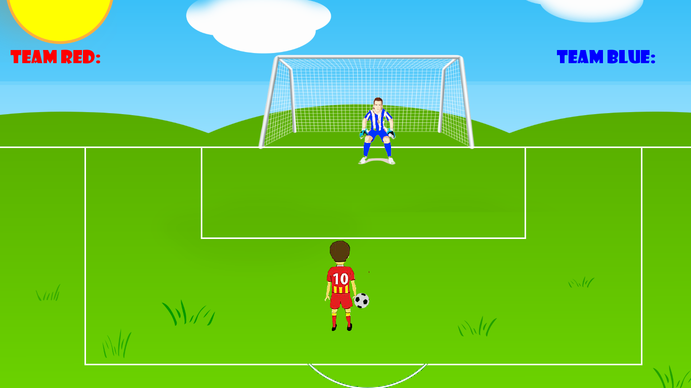
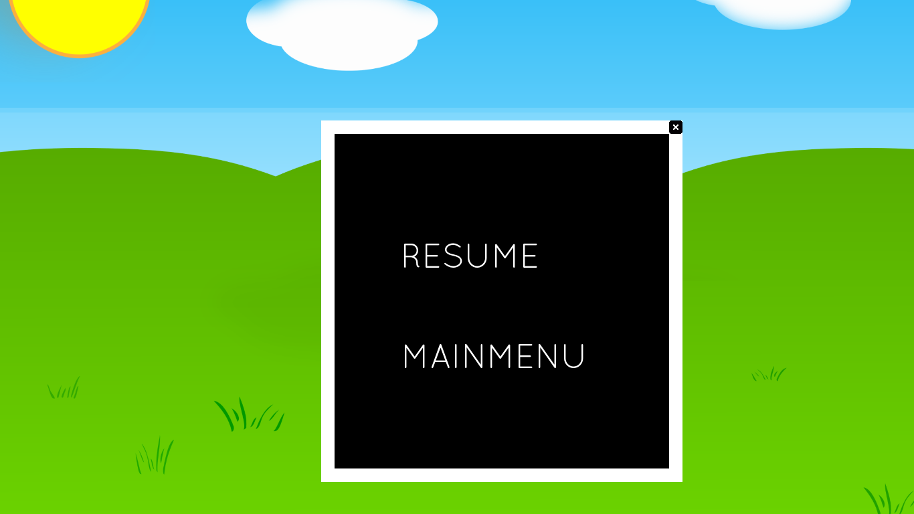

# PenaltyFever

Football Penalty game made using SFML C++ 

A game to enjoy for all football lovers.

This game is made as a part of our Project for C++

## Contributors:

Saujan Tiwari

Sandeep Acharya

Sangam Chaulagain

# Build Instructions
* Clone the project using git-clone place-git-url-here
* Download Code::Blocks IDE from [here](https://sourceforge.net/projects/codeblocks/files/Binaries/20.03/Windows/codeblocks-20.03mingw-setup.exe/download).
* Install Code::Blocks IDE.
* Open .cbp file located in the cloned project inside Current Game.
* Build and run the project in debug mode.

# Game Play
### Main Screen

### How To Play

### Single Player Mode

### Multi Player Mode

### Game Paused

